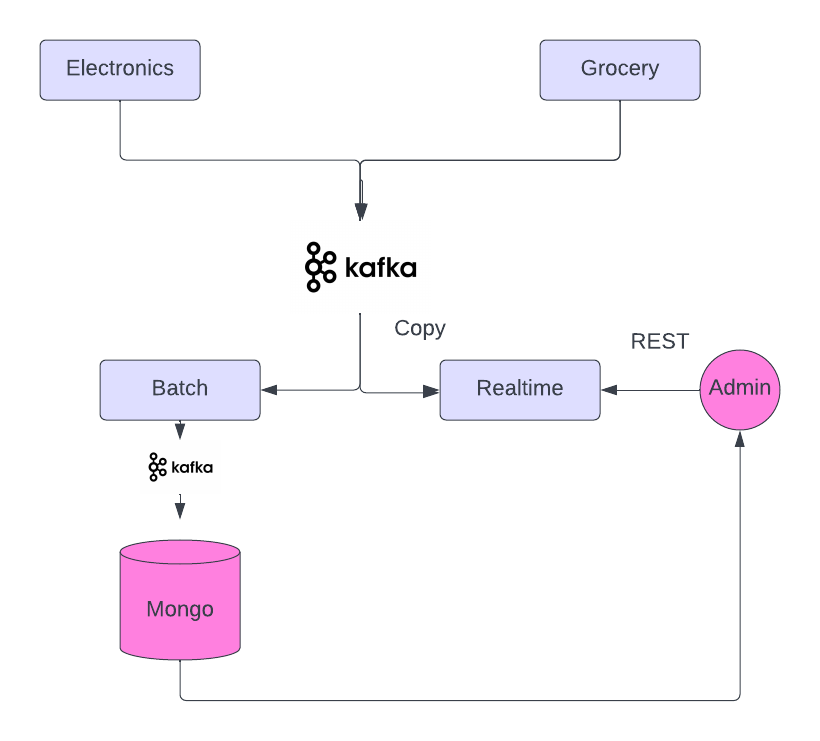

# kafka-lambda

### What is this?

I did this application to learn Kafka and refresh knowledge of Kubernetes. It's an imaginary example
of online e-commerce store.

### Domain

App is an model of communication between retail divisions and warehouse. The orders are coming in realtime,
then they are aggregated in windows of certain duration (1 minute) and stored in warehouse's database for
realization. The stream splits as well to the admin service to show outstanding orders counting from 
last batches time.

### Technology

The communication is very basic, it's single node kafka with topics in between the services. *producers*
generate random orders, send them via *electronics* or *grocery* topics to *streams* service. Streams service
uses Kafka plugin for *flux* and windows the orders in one minute window. Aggregation is stored in MongoDB
document while the second stream is sent to *realtime* topic which is used by *admin* service to display 
outstanding orders.

### Gotchas

* I found that Flux is more comprehensive and has less steep learning curve that Kafka Streams.
* You have to set Kafkas advertised.listeners poiting to kuberenetes service
* By default Kafka stores consumer offsets in topic with replication 3, you have to set it to one in this case
* Kafka Streams is hard because you have to write Serdes for collections 